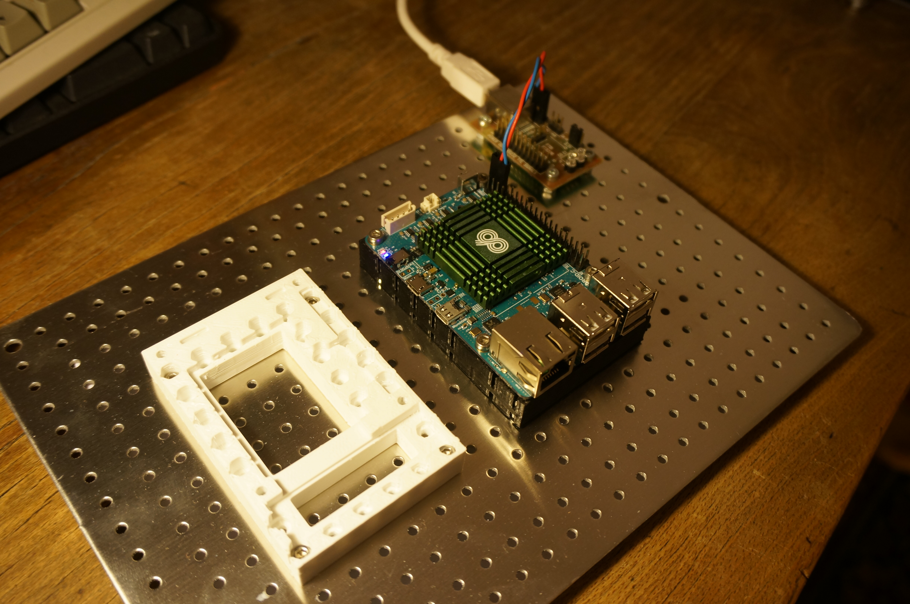

<!--- Created:2017-01-02T13:58:39.633574: ---> 
<!--- Author:Mlab: ---> 
<!--- AuthorEmail:email@mlab.cz: ---> 
<!--- Tags:None: ---> 
<!--- Ust:None: ---> 
<!--- Name:ODROID-C1: --->
#ODROID-C1 
<!--- LongName --->
Four core ARM computer module
<!--- ELongName ---> 

<!--- Lead --->
Computer module for applications which needs full Linux operating system and lot of computing power. It is suitable for machine control or home automation as example.
<!--- ELead ---> 

 

​
​
<!--- Description --->
<!--- EDescription --->
<!--- Content --->
<!--- EContent --->
            