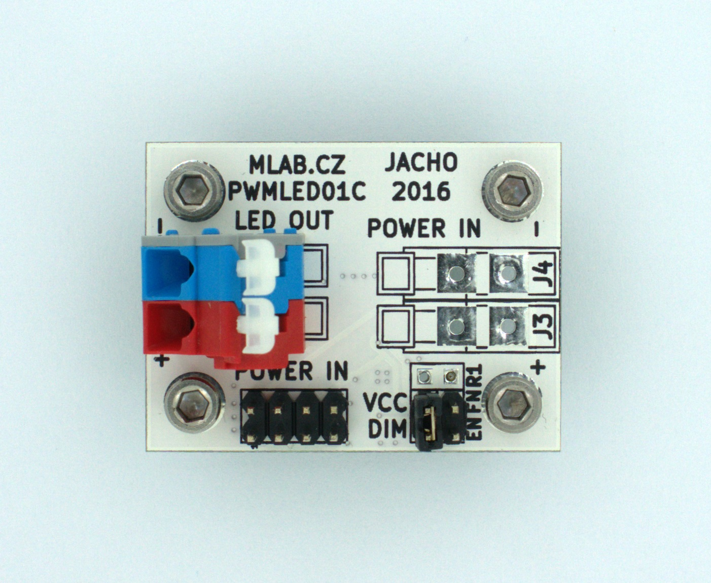

<!--- Created:2017-01-02T13:58:39.552370: ---> 
<!--- Author:Mlab: ---> 
<!--- AuthorEmail:email@mlab.cz: ---> 
<!--- Tags:None: ---> 
<!--- Ust:None: ---> 
<!--- Name:PWMLED01C: --->
#PWMLED01C 
<!--- LongName --->
PWM LED control module
<!--- ELongName ---> 

<!--- Lead --->
This module is usefull for PWM dimming of power LEDs.
<!--- ELead ---> 

 

​
​
<!--- Description --->
<!--- EDescription --->
<!--- Content --->
<!--- EContent --->
            