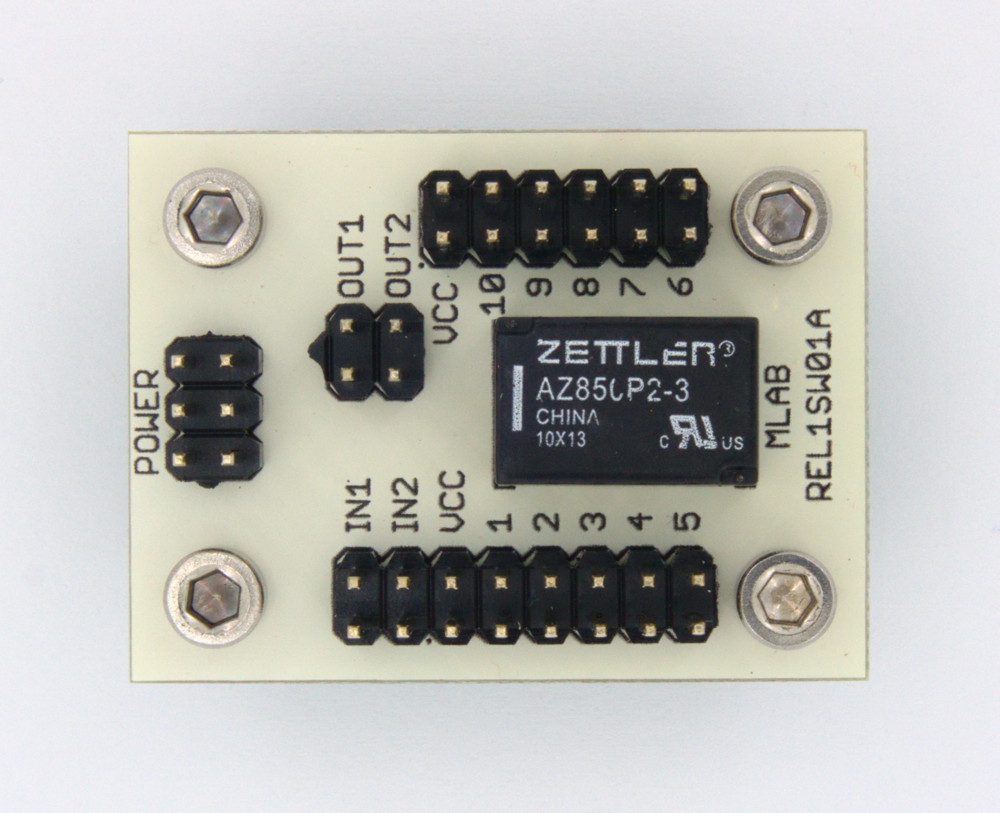

<!--- AUTOgen ---> <!--- Please remove this line after manually editing --->
<!--- Created:2017-01-02T14:38:45.822013: ---> 
<!--- Author:Mlab: ---> 
<!--- AuthorEmail:email@mlab.cz: ---> 
<!--- Tags:None: ---> 
<!--- Ust:None: ---> 
<!--- Name:REL1SW01A: --->
#REL1SW01A 
<!--- LongName --->
1 RELAY OR 2NMOSFET
<!--- ELongName ---> 

<!--- Lead --->
Universal module for relays. The module is equipped with two NMOSFETy that are designed for relay processor. Wiring module allows you to use two transistors alone without the relay as a switch to GND.
<!--- ELead ---> 

 

​
​
<!--- Description --->
<!--- EDescription --->
<!--- Content --->
<!--- EContent --->
            