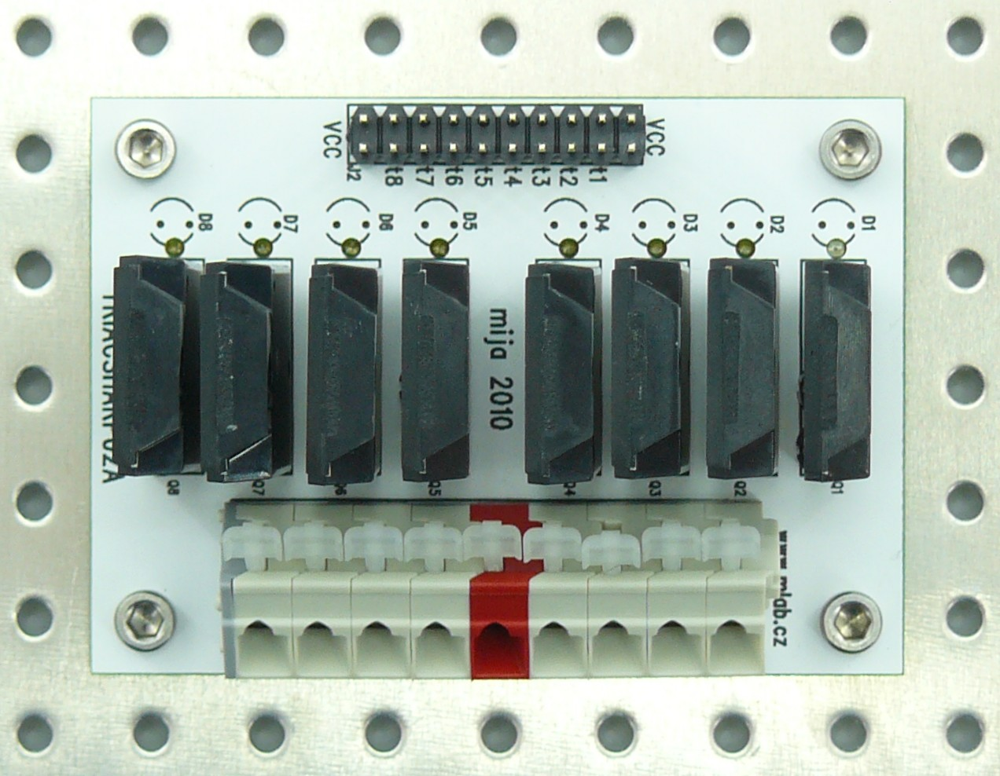

<!--- AUTOgen ---> <!--- Please remove this line after manually editing --->
<!--- Created:2017-01-02T14:38:45.824620: ---> 
<!--- Author:Mlab: ---> 
<!--- AuthorEmail:email@mlab.cz: ---> 
<!--- Tags:None: ---> 
<!--- Ust:None: ---> 
<!--- Name:TRIACSHARP02A: --->
#TRIACSHARP02A 
<!--- LongName --->
Semiconductor relay switch module
<!--- ELongName ---> 

<!--- Lead --->
There are 8 solid state switching relays which can be digitally controlled by open collector. It can operate up to 8A on 250VAC.
<!--- ELead ---> 

 

​
​
<!--- Description --->
<!--- EDescription --->
<!--- Content --->
<!--- EContent --->
            