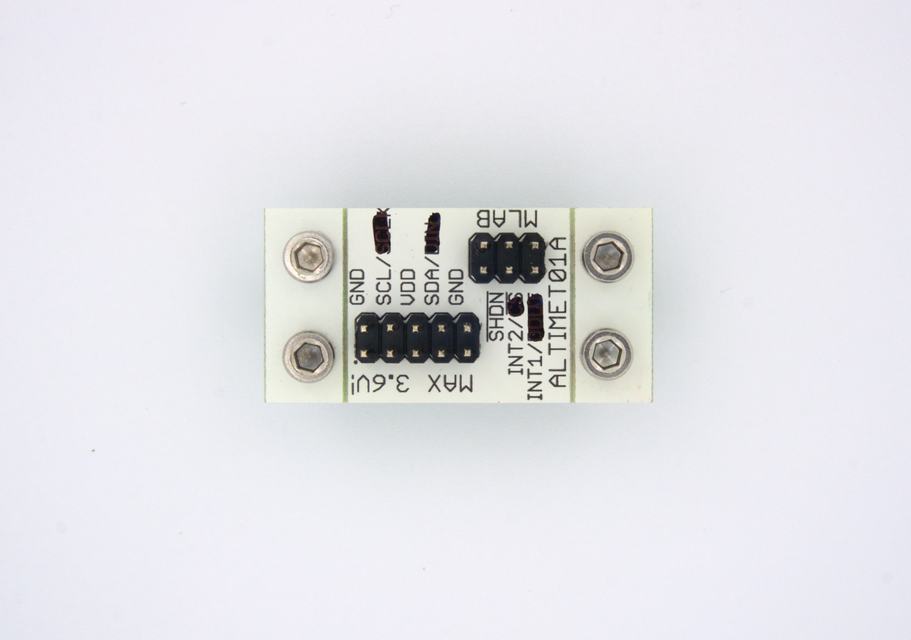

<!--- PrjInfo ---> <!--- Please remove this line after manually editing --->
<!--- 00a56be08b96043df9e37d6aff7b6990 --->
<!--- Created:2017-01-02T19:34:51.767826: ---> 
<!--- Author:Mlab: ---> 
<!--- AuthorEmail:email@mlab.cz: ---> 
<!--- Tags:None: ---> 
<!--- Ust:None: ---> 
<!--- Name:ALTIMET01A: --->
#ALTIMET01A 
<!--- LongName --->

<!--- ELongName ---> 

<!--- Lead --->
Breakout board for MPL115A1 or MPL115A2 integrated sensor chips. The sendor is capable to measure absolute pressure and temperature. It can be connectod to I2C bus.
<!--- ELead ---> 

 

​
​
<!--- Description --->
<!--- EDescription --->
<!--- Content --->
<!--- EContent --->
            