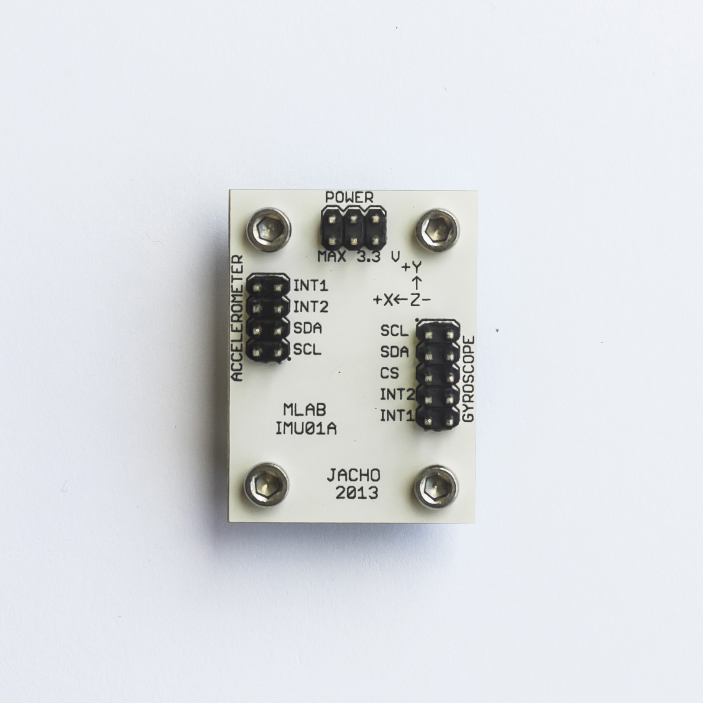

<!--- PrjInfo ---> <!--- Please remove this line after manually editing --->
<!--- 00a56be08b96043df9e37d6aff7b6990 --->
<!--- Created:2017-01-02T19:34:51.759531: ---> 
<!--- Author:Mlab: ---> 
<!--- AuthorEmail:email@mlab.cz: ---> 
<!--- Tags:None: ---> 
<!--- Ust:None: ---> 
<!--- Name:IMU01A: --->
#IMU01A 
<!--- LongName --->
Digital 3-axis accelerometer and gyroscope
<!--- ELongName ---> 

<!--- Lead --->
The module can be fitted with circuit MMA8451Q. It is a 3-axis accelerometer with 14-bit resolution. A3G4250D circuit provides the 3-axis gyroscope. Both circuits enable communication via I2C. On the module is not necessary to assemble both IO.
<!--- ELead ---> 

 

​
​
<!--- Description --->
<!--- EDescription --->
<!--- Content --->
<!--- EContent --->
            