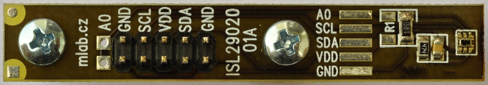

<!--- Created:2017-01-02T13:58:39.609027: ---> 
<!--- Author:Mlab: ---> 
<!--- AuthorEmail:email@mlab.cz: ---> 
<!--- Tags:None: ---> 
<!--- Ust:None: ---> 
<!--- Name:ISL2902001A: --->
#ISL2902001A 
<!--- LongName --->
Light sensor.
<!--- ELongName ---> 

<!--- Lead --->
Light sensor ISL29020 with I2C interface. Measurement range 0.015lux - 64.000lux.
<!--- ELead ---> 

 

​
​
<!--- Description --->
<!--- EDescription --->
<!--- Content --->
<!--- EContent --->
            