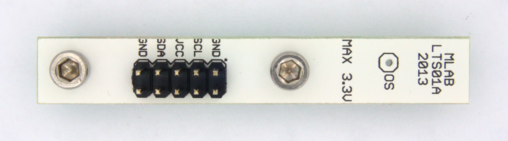

<!--- Created:2017-01-02T13:58:39.590282: ---> 
<!--- Author:Mlab: ---> 
<!--- AuthorEmail:email@mlab.cz: ---> 
<!--- Tags:None: ---> 
<!--- Ust:None: ---> 
<!--- Name:LTS01A: --->
#LTS01A 
<!--- LongName --->
Local Temperature Sensor
<!--- ELongName ---> 

<!--- Lead --->
Temperature sensor with I2C digital bus and absolute accuracy of 0.5 K.
<!--- ELead ---> 

 

​
​
<!--- Description --->
<!--- EDescription --->
<!--- Content --->
<!--- EContent --->
            