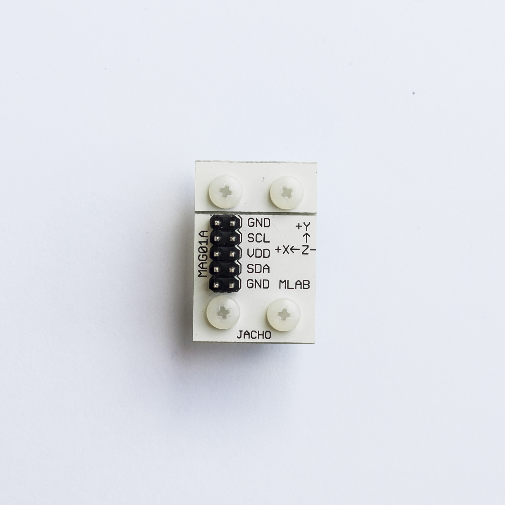

<!--- PrjInfo ---> <!--- Please remove this line after manually editing --->
<!--- 00a56be08b96043df9e37d6aff7b6990 --->
<!--- Created:2017-01-02T19:34:51.766247: ---> 
<!--- Author:Mlab: ---> 
<!--- AuthorEmail:email@mlab.cz: ---> 
<!--- Tags:None: ---> 
<!--- Ust:None: ---> 
<!--- Name:MAG01A: --->
#MAG01A 
<!--- LongName --->

<!--- ELongName ---> 

<!--- Lead --->
Precision I2C magnetometer for compass and navigation applications in robotics.
<!--- ELead ---> 

 

​
​
<!--- Description --->
<!--- EDescription --->
<!--- Content --->
<!--- EContent --->
            