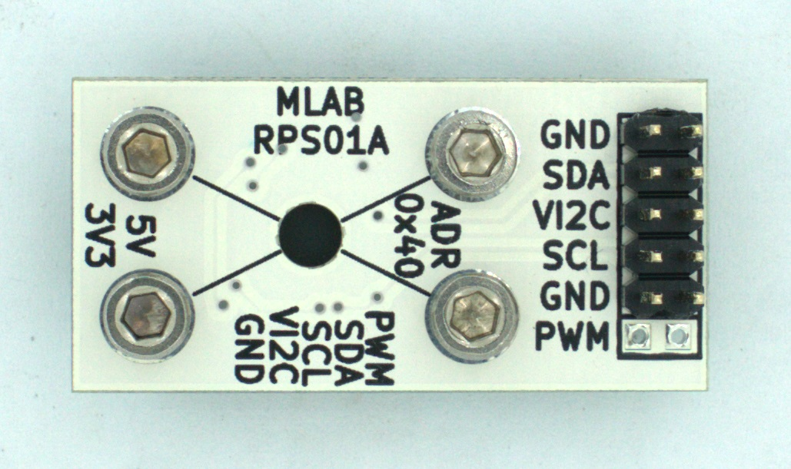

<!--- tags --->

<!--- Created:2017-01-02T00:12:37.669939: ---> 
<!--- Author:['Mlab','MLAB2']: ---> 
<!--- AuthorEmail:['email@mlab.cz']: ---> 
<!--- Name:RPS01A: --->
#RPS01A 
<!--- LongName --->
Rotary Magnetic Position sensor
<!--- ELongName ---> 

<!--- Lead --->
In is a contactless magnetic position sensor for accurate angular measurement over a full turn of 360 degrees. To measure the angle, only a simple two-pole magnet, rotating over the center of the chip, is required. The absolute angle measurement provides instant indication of the magnet’s angular position with a resolution of 0.0879º. This digital data is available as a serial bit stream.
<!--- ELead ---> 

 

<!--- Description --->
<!--- EDescription --->
<!--- Content --->
<!--- EContent --->
