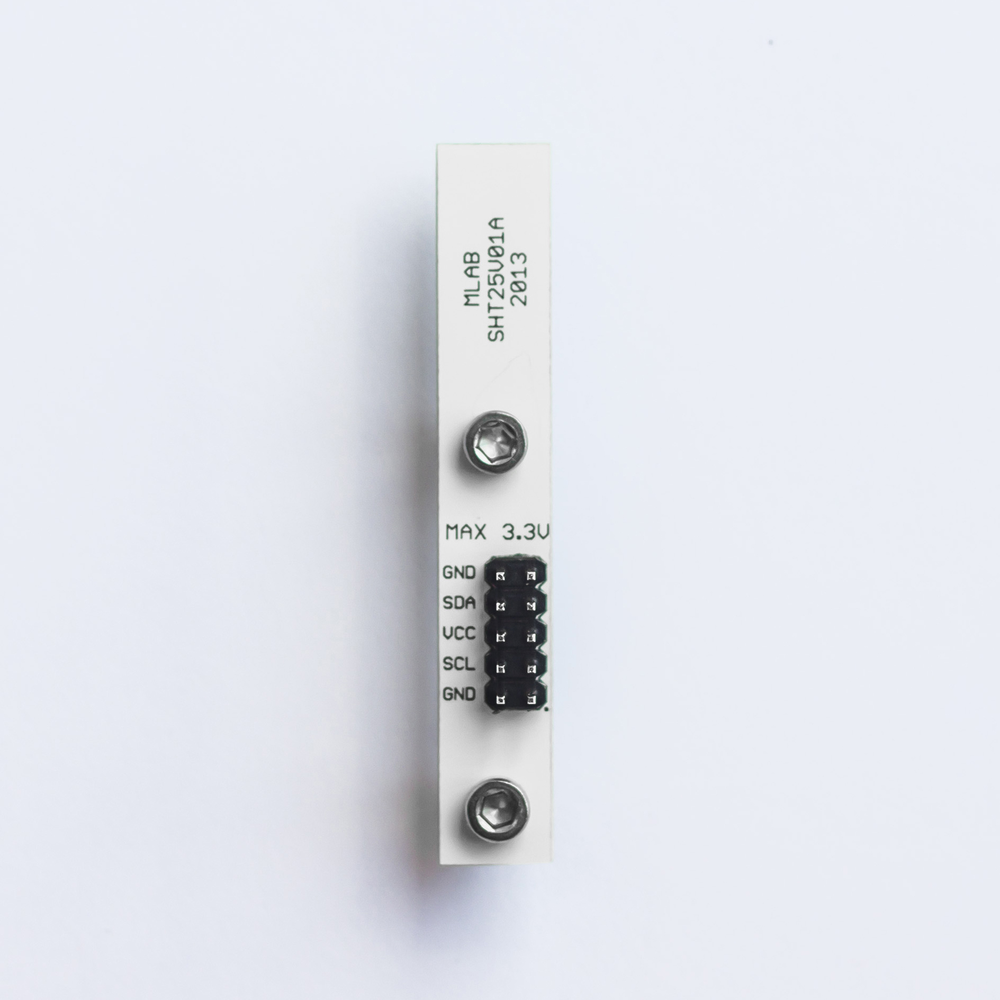

<!--- AUTOgen ---> <!--- Please remove this line after manually editing --->
<!--- Created:2017-01-02T14:38:45.859246: ---> 
<!--- Author:Mlab: ---> 
<!--- AuthorEmail:email@mlab.cz: ---> 
<!--- Tags:None: ---> 
<!--- Ust:None: ---> 
<!--- Name:SHT25V01A: --->
#SHT25V01A 
<!--- LongName --->
Digital sensor relative humidity and temperature
<!--- ELongName ---> 

<!--- Lead --->
SHT25 sensor module which measures relative humidity from 0% to 100% with an accuracy of + / - 1.8%. Temperature is measured in the range -40 ° C to 125 ° C with a  an accuracy of 0.2 ° C.
<!--- ELead ---> 

 

​
​
<!--- Description --->
<!--- EDescription --->
<!--- Content --->
<!--- EContent --->
            